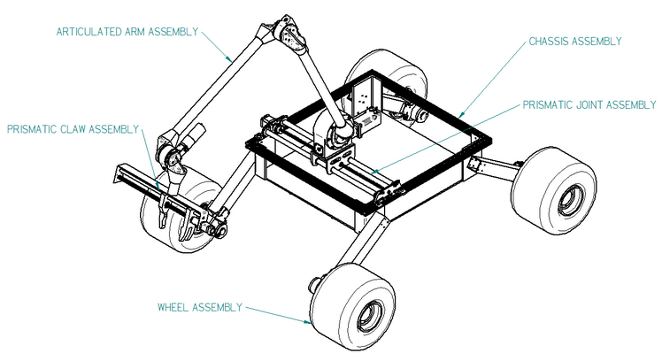
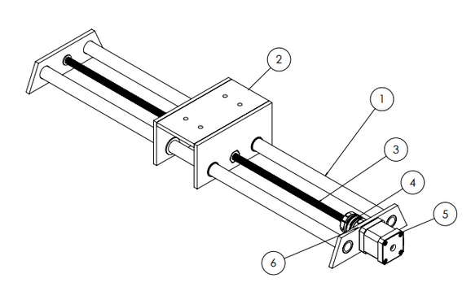
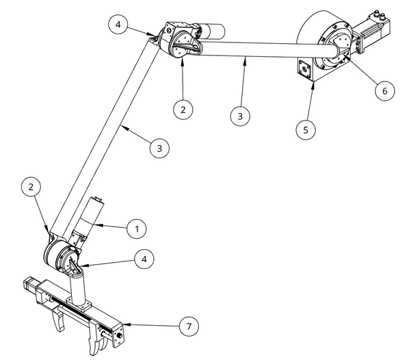
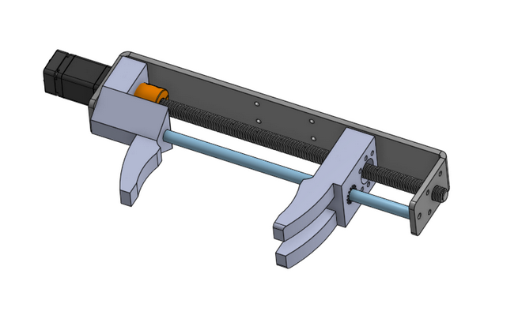
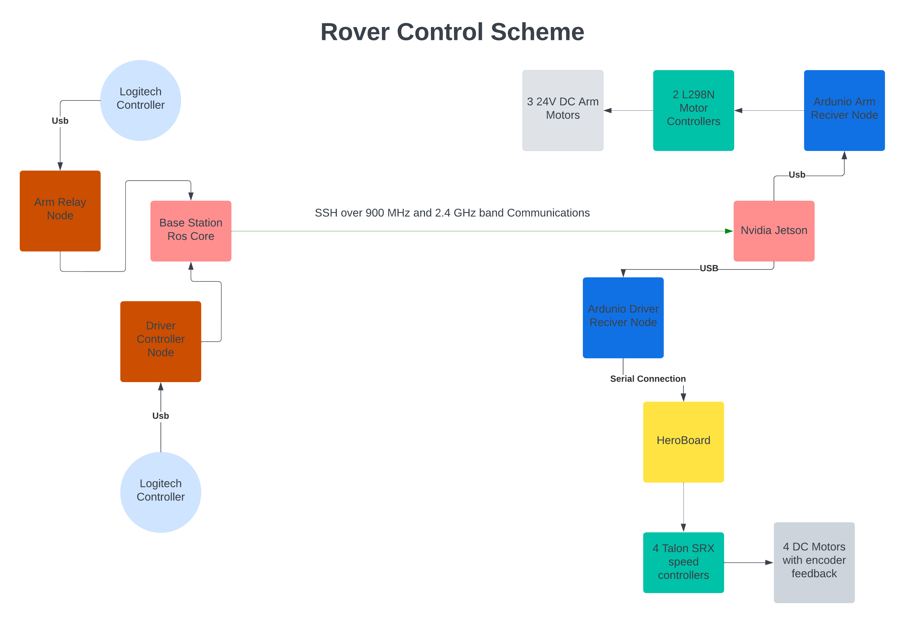

# Senior Capstone

## Responsibilites and Overview of Personal Contribution

* **Team Lead**: Organized team into an agile environment using the project management software Click-Up.

* **Software and Controls Lead**: Took existing software in ROS and rewrote libraries to better leverage third-party packages and streamline communications.

* **Co-created Robotic Arm**: assisted in design, analysis, manufacturing and wiring. Designed control code on Arduinos and in ROS to move arm with game-pad leveraging DC and stepper motor controllers.

# Overview of Rover

# System Overview

The Adventure rover is a multidisciplinary robotics project that requires expertise in various engineering fields. The team's goal this year was to improve specific subsystems to make the rover competitive in the URC competition. The rover operates through a base station connected to the rover's computer. The rover can be controlled using gamepad controllers that regulate the speed of the wheels and movement of the robotic arm. The overall system is robust and an improvement upon last year's design. The below figure is the high-level diagram of the final design.

## Arm Design

### Linear Actuator

The arm contains an aptly named component, the prismatic joint, shown in the image below. A prismatic joint is a mechanism, linkage, or other controlling device that restricts motion to one axis. The rover prismatic joint is bolted to the chassis, and subsequently, the arm is bolted to the prismatic joint. The main linkage of the arm (excluding the claw mechanism) operates in a single plane. That plane is created by the vertical axis and the axis that runs front to back of the rover.

The prismatic joint was designed to allow the arm to travel in the direction orthogonal to its plane of motion. The intent of the prismatic joint is to allow URC tasks requiring the arm to be completed easier. Without the prismatic joint, perfect alignment of the arm would need to be achieved by the overall motion of the rover, i.e. using the rover wheels. In camera vision, this was deemed to be a difficult task. The prismatic joint allows the rover to be stationary while manipulating the arm alone to retrieve or operatie objects.

### Arm Assembly

The articulating arm is the section of the arm that ranges from being mounted on the prismatic joint and extends to the claw. At the base, the arm utilizes a Robolink D50 motor (RL-D50) mounted to the prismatic joint (Shoulder joint). The RL-D50, indicated by balloon 5 on the arm figure, is a motor-gearbox combination that supplies the torque and the precision required to control articulating arm and strong enough to hold loads up to 100kg. The next joint up the chain is the Robolink D30 (Elbow joint), which is like the RL-D50 but smaller with a lower torque rating. The final joint before the claw is the Robolink D20 (Wrist joint). The RL-D20 is light enough to lift with the arm extended, but has the required torque to move the claw. All three joints use the same DC motor with different gear boxes. Each joint is mounted together with custom made 3D printed ABS brackets. The ABS brackets are pinned and glued to 38 mm carbon fiber tubing. The carbon fiber tubing supplies the stiffness and strength required for all of the lifting and moving without the added weight of other materials such as aluminum. With the arm fully extended, it has a reach of 4.5 ft, but the maximum carry weight quickly decreases with arm extension due to the moment incurred.

### Claw

Similar to the foundation of the whole arm, the prismatic joint, the prismatic claw allows one of the two grippers to have a single degree of freedom and the other gripper to remain fixed. As shown in the claws figure, the “double finger” gripper is mounted to a ball nut and driven by a lead screw allowing it a linear motion toward and away from the fixed “single finger” gripper. The grippers are 3D printed using PLA, although ABS would be a viable option as well. The driven gripper runs along a single guide rail and is printed with a low contact pattern to decrease friction as it slides across the rail. The frame of the claw uses the same ¼’’ aluminum plate that the chassis is made from, cut and bent to shape.

The lead screw turns using a Nema 11 closed loop stepper motor. This allows for feedback and accurate positioning of the arm from a controls standpoint. The motor has a torque rating of 0.1 N*m, which is enough to turn the driven “double finger” claw. It also provides enough torque to generate clamping force to grip 5 kg objects. The URC dictates this as the minimum weight pickup requirement. Additionally, this provides the ability to drag objects and open drawers. The fingers can also be put in alternate positions to complete the other required tasks, such as button pushing and flip switching. For pushing buttons and typing on a keyboard, the fingers spread out and the “single finger” performs the task. For flipping switches, the fingers clamp together.

## Control System Overview

### Figure 1: Code Diagram of Electronics and Data Flow

### **Communication and Controls**

The communication scheme and connections for the Adventure rover are presented in Figure 1, which illustrates the data flow for the entire rover. As shown in the figure, the base station is connected to the rover's computer through a wireless communication system that utilizes the 900 MHz and 2.1 GHz bands.

### **Drive Controls**

The previous year's team used a HERO Development board, a CAN bus-enabled microcontroller, to operate the Talon SRX speed controllers and control the speed of the motors. However, the current team reduced the number of wheels from six to four, which led to a polarity reversal of two wheels and a 33% increase in voltage to the motors, causing an increase in wheel speed. The team addressed this issue by reworking the communication and code that sends signals to the Talon SRX speed controllers. Additionally, the team reworked the Simple DirectMedia Layer (SDL), a C++ library, to read logitech controller inputs to regulate the motors. This allowed for static assigning of controllers to prevent conflicting signals and ensured that all controllers could be connected in any order.

### **Arm Controls**

Since the arm was replaced with an in-house built arm, the motors and electronics required a complete overhaul. The new arm employs worm gear joints connected to 24V DC motors. Initially, these motors contained encoders that allowed for closed loop feedback control to track the motor's position. However, the encoders prevented full rotation of the arm, making it unsuitable for the arm's application. Therefore, an open-loop control design was implemented. The team utilized the joy framework within the Robotic Operating System (ROS) to obtain input from a logitech controller. The team created a ROS node on the base station that interprets the controller input and sends information in the form of 2, 0, and -2 to each motor, indicating the polarity and power of the motor. This information is picked up by an Arduino connected to the rover's computer, which sends a full power signal to the motor on input and decays it over half a second unless another signal is received.

## Video of Completed Rover

